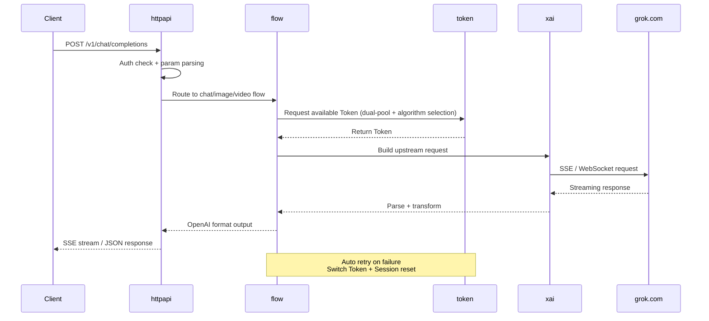

<h1 align="center">GrokForge</h1>

<p align="center">
  <b>Full-model OpenAI-compatible Grok API gateway — single binary, ready to run</b>
</p>

<p align="center">
  <b>English</b> · <a href="./README.zh.md">简体中文</a>
</p>

<p align="center">
  <a href="https://github.com/crmmc/grokforge/releases"></a>
  <a href="https://github.com/crmmc/grokforge/blob/main/LICENSE"></a>
  <a href="https://github.com/crmmc/grokforge"></a>
  <a href="https://github.com/crmmc/grokforge"></a>
</p>

---

## What is this

GrokForge wraps all Grok web capabilities (chat, reasoning, image generation/editing, video generation) into a standard OpenAI API format (a.k.a. 2api gateway). You can seamlessly connect any OpenAI-compatible client (ChatGPT Next Web, LobeChat, Open WebUI, Cursor, bots, etc.) to Grok models.

> Go rewrite + Next.js admin panel, compiled into a single binary, SQLite out of the box, zero external dependencies.

---

## Highlights

- **Single binary deployment** — Frontend embedded via `go:embed`, just copy and run
- **Modern admin panel** — Next.js + shadcn/ui, one-stop Dashboard / Token / API Key / Settings / Usage / Cache management
- **Dual-pool token routing** — ssoBasic / ssoSuper grouped by model, 3 selection algorithms + priority tiers + auto fallback
- **Three independent quotas** — Chat / Image / Video metered and recovered separately
- **Hot-reload config** — Admin panel changes take effect immediately, no restart needed
- **Structured logging** — slog + file rotation, JSON / Text formats
- **Bilingual UI** — Admin panel supports English and Chinese

---

## Features

### Core

- [x] **OpenAI Chat Completions API** — Streaming / non-streaming, fully compatible
- [x] **Chain-of-thought reasoning** — `<think>` tag output, `reasoning_effort` control
- [x] **Tool Calling** — Hermes-style tool calls with parallel_tool_calls support
- [x] **Multimodal input** — Image URL / base64, auto download, decode and resize
- [x] **Image generation / editing** — WebSocket channel, multiple images, various sizes
- [x] **Video generation** — Multiple aspect ratios and resolutions
- [x] **Model listing** — `GET /v1/models` dynamically returns models, hot-configurable

### Token Management

- [x] **Dual-pool routing** — ssoBasic / ssoSuper grouped by model, auto fallback
- [x] **3 selection algorithms** — high_quota_first / random / round_robin
- [x] **Priority tiers** — Higher priority tokens are selected first
- [x] **Three quota categories** — Chat / Image / Video independently metered and recovered
- [x] **Auto refresh** — Periodic session refresh, auto rebuild on failure
- [x] **Token state machine** — active / cooling / disabled / expired four-state transitions

### Security & Reliability

- [x] **API Key management** — CRUD + model whitelist + daily limit + rate limit
- [x] **Exponential backoff retry** — Jitter + budget control + session auto-reset
- [x] **Cloudflare defense** — FlareSolverr integration, instant 403 refresh + debounce
- [x] **Secure authentication** — Constant-time comparison, empty AppKey rejects access

### Admin Panel

- [x] **Dashboard** — Stats cards + quota progress + usage trend charts
- [x] **Token management** — Batch import / enable / disable / delete, status filtering, health indicators
- [x] **API Key management** — Create / disable / expire / regenerate keys
- [x] **System settings** — General + Models dual tabs, hot-reload on save
- [x] **Usage stats** — Aggregate overview + per-request logs (with TTFT)
- [x] **Cache management** — Image / video stats, preview / download / batch cleanup
- [x] **Playground** — Chat / Image / Video generation online, multi-turn conversation with Markdown rendering

---

## Supported Models

<details>
<summary><b>Chat Models</b></summary>

| Model | Description |
|-------|-------------|
| `grok-3` | Grok 3 Standard |
| `grok-3-mini` | Grok 3 Lite |
| `grok-3-thinking` | Grok 3 Chain-of-Thought |
| `grok-4` | Grok 4 Standard |
| `grok-4-heavy` | Grok 4 Enhanced |
| `grok-4-mini` | Grok 4 Lite |
| `grok-4-thinking` | Grok 4 Chain-of-Thought |
| `grok-4.1-expert` | Grok 4.1 Expert |
| `grok-4.1-fast` | Grok 4.1 Fast |
| `grok-4.1-mini` | Grok 4.1 Lite |
| `grok-4.1-thinking` | Grok 4.1 Chain-of-Thought |
| `grok-4.20-beta` | Grok 4.20 Beta |

</details>

<details>
<summary><b>Media Models</b></summary>

| Model | Description |
|-------|-------------|
| `grok-imagine-1.0` | Image generation |
| `grok-imagine-1.0-fast` | Fast image generation |
| `grok-imagine-1.0-edit` | Image editing (supports reference images) |
| `grok-imagine-1.0-video` | Video generation |

</details>

> Models can be dynamically added/removed via the admin panel without restarting.

---

## Quick Start

### 30-Second Setup

```bash
# 1. Download & start
./grokforge -config config.toml

# 2. Open admin panel and add your Grok Token
#    http://localhost:8080

# 3. Test
curl http://localhost:8080/v1/chat/completions \
  -H "Authorization: Bearer your-api-key" \
  -H "Content-Type: application/json" \
  -d '{
    "model": "grok-4",
    "messages": [{"role": "user", "content": "Hello!"}],
    "stream": true
  }'
```

### Build from Source

**Prerequisites**: Go 1.24+, Node.js 18+

```bash
git clone https://github.com/crmmc/grokforge.git
cd grokforge

# Copy config template
cp config.defaults.toml config.toml

# One-command build (frontend + backend)
make build

# Run
./bin/grokforge
```

The build output is a single binary with the frontend embedded via `go:embed`.

---

## Configuration

GrokForge uses TOML configuration. See [`config.defaults.toml`](./config.defaults.toml) for the full template.

### Minimal Config

```toml
[app]
app_key = "your-admin-password"   # Admin password (REQUIRED: empty value rejects all admin requests)
port = 8080                        # Server port

[proxy]
base_proxy_url = ""                # Optional: proxy URL
```

After startup, add Grok Tokens in the admin panel. All other settings can be modified online.

### Config Priority

```
Admin panel (DB) > config.toml > Built-in defaults
```

Admin panel changes take effect immediately without restart.

### Core Settings

<details>
<summary><b>Application [app]</b></summary>

| Key | Default | Description |
|-----|---------|-------------|
| `app_key` | `""` | Admin password (empty rejects all admin requests) |
| `loginKey` | `""` | Static login key for `/v1` access (empty uses API Key database) |
| `port` | `8080` | Server port |
| `host` | `"0.0.0.0"` | Listen address |
| `db_driver` | `"sqlite"` | Database driver: `sqlite` / `postgres` |
| `db_path` | `"data/grokforge.db"` | SQLite file path |
| `db_dsn` | `""` | PostgreSQL connection string |
| `log_level` | `"info"` | Log level: debug/info/warn/error |
| `log_json` | `false` | JSON format logs |
| `request_timeout` | `60` | Default timeout for non-LLM routes (seconds) |
| `temporary` | `true` | Temporary conversation mode |
| `thinking` | `true` | Enable chain-of-thought by default |
| `stream` | `true` | Streaming response by default |
| `filter_tags` | `[...]` | Special tags to filter |

</details>

<details>
<summary><b>Proxy [proxy]</b></summary>

| Key | Default | Description |
|-----|---------|-------------|
| `base_proxy_url` | `""` | Upstream proxy (HTTP/HTTPS/SOCKS5) |
| `asset_proxy_url` | `""` | Asset proxy (image downloads, etc.) |
| `cf_clearance` | `""` | Cloudflare clearance cookie |
| `browser` | `"chrome_146"` | TLS fingerprint browser profile |
| `enabled` | `false` | Enable CF auto-refresh |
| `flaresolverr_url` | `""` | FlareSolverr service URL |
| `refresh_interval` | `3600` | CF refresh interval (seconds) |

</details>

<details>
<summary><b>Retry Policy [retry]</b></summary>

| Key | Default | Description |
|-----|---------|-------------|
| `max_tokens` | `5` | Maximum tokens to try |
| `per_token_retries` | `2` | Maximum retries per token before switching |
| `reset_session_status_codes` | `[403]` | Status codes that trigger session reset |
| `retry_backoff_base` | `0.5` | Backoff base delay (seconds) |
| `retry_backoff_factor` | `2.0` | Backoff multiplier |
| `retry_backoff_max` | `20.0` | Maximum single delay (seconds) |
| `retry_budget` | `60.0` | Total retry budget (seconds) |

</details>

<details>
<summary><b>Token Management [token]</b></summary>

| Key | Default | Description |
|-----|---------|-------------|
| `fail_threshold` | `5` | Consecutive failure threshold (marks expired) |
| `usage_flush_interval_sec` | `30` | Interval for flushing usage stats to DB |
| `cool_check_interval_sec` | `30` | Interval for checking cooldown recovery |

</details>

---

## Architecture

```
┌─────────────────────────────────────────────────┐
│                   Client                        │
│   (ChatGPT Next Web / LobeChat / curl / ...)    │
└─────────────────────┬───────────────────────────┘
                      │ OpenAI API
                      ▼
┌─────────────────────────────────────────────────┐
│                   GrokForge                     │
│                                                 │
│  ┌───────────┐  ┌───────────┐  ┌────────────┐  │
│  │  httpapi   │  │   Admin   │  │  Static    │  │
│  │ (OpenAI)  │  │   API     │  │  Frontend  │  │
│  └─────┬─────┘  └─────┬─────┘  └────────────┘  │
│        │              │                         │
│        ▼              ▼                         │
│  ┌─────────────────────────────────────────┐    │
│  │           flow (orchestration)          │    │
│  │   chat / image / video / model routing  │    │
│  └──────┬──────────┬──────────┬────────────┘    │
│         │          │          │                  │
│         ▼          ▼          ▼                  │
│  ┌──────────┐ ┌─────────┐ ┌──────────┐         │
│  │  token   │ │   xai   │ │  store   │         │
│  │  (pool)  │ │(upstream)│ │(persist) │         │
│  └──────────┘ └─────────┘ └──────────┘         │
│                    │                            │
└────────────────────┼────────────────────────────┘
                     │
                     ▼
              ┌─────────────┐
              │   grok.com  │
              │ (SSE / WS)  │
              └─────────────┘
```

Three-tier architecture: **httpapi** (protocol translation) → **flow** (business orchestration) → **xai / token / store** (infrastructure)

Unidirectional dependencies, no circular references.

---

## Request Flow



---

## Admin Panel

> Admin panel URL: `http://your-host:8080`

The admin panel includes:

- **Dashboard** — System status at a glance: Token count, API Key count, call volume, quota progress, trend charts
- **Token Management** — Batch import / enable / disable / delete, status filtering, quota editing, priority settings, manual refresh
- **API Key** — Create and manage API keys, model whitelist, daily limit, rate limit
- **Settings** — Global config online editing, changes take effect immediately
- **Usage Stats** — Aggregate overview + per-request logs (including TTFT, token consumption metrics)
- **Cache** — Image / video cache browsing, preview, download, cleanup
- **Playground** — Chat / Image / Video generation online, multi-turn conversation with Markdown rendering

---

## API Examples

### Chat Completion (Streaming)

```bash
curl http://localhost:8080/v1/chat/completions \
  -H "Authorization: Bearer your-api-key" \
  -H "Content-Type: application/json" \
  -d '{
    "model": "grok-4",
    "messages": [{"role": "user", "content": "Explain quantum computing in one sentence"}],
    "stream": true
  }'
```

### Chain-of-Thought Model

```bash
curl http://localhost:8080/v1/chat/completions \
  -H "Authorization: Bearer your-api-key" \
  -H "Content-Type: application/json" \
  -d '{
    "model": "grok-4-thinking",
    "messages": [{"role": "user", "content": "Prove that √2 is irrational"}],
    "reasoning_effort": "high"
  }'
```

### Tool Calling

```bash
curl http://localhost:8080/v1/chat/completions \
  -H "Authorization: Bearer your-api-key" \
  -H "Content-Type: application/json" \
  -d '{
    "model": "grok-4",
    "messages": [{"role": "user", "content": "What is the weather in Beijing today?"}],
    "tools": [{
      "type": "function",
      "function": {
        "name": "get_weather",
        "description": "Get weather for a city",
        "parameters": {
          "type": "object",
          "properties": {
            "city": {"type": "string", "description": "City name"}
          },
          "required": ["city"]
        }
      }
    }]
  }'
```

### Multimodal (Image Input)

```bash
curl http://localhost:8080/v1/chat/completions \
  -H "Authorization: Bearer your-api-key" \
  -H "Content-Type: application/json" \
  -d '{
    "model": "grok-4",
    "messages": [{
      "role": "user",
      "content": [
        {"type": "text", "text": "Describe this image"},
        {"type": "image_url", "image_url": {"url": "https://example.com/image.jpg"}}
      ]
    }]
  }'
```

### Image Generation

```bash
curl http://localhost:8080/v1/chat/completions \
  -H "Authorization: Bearer your-api-key" \
  -H "Content-Type: application/json" \
  -d '{
    "model": "grok-imagine-1.0",
    "messages": [{"role": "user", "content": "A shiba inu in a spacesuit walking on the moon"}]
  }'
```

### Video Generation

```bash
curl http://localhost:8080/v1/chat/completions \
  -H "Authorization: Bearer your-api-key" \
  -H "Content-Type: application/json" \
  -d '{
    "model": "grok-imagine-1.0-video",
    "messages": [{"role": "user", "content": "A cat dancing on a piano"}]
  }'
```

---

## Client Integration

GrokForge is compatible with all OpenAI API clients — just point the API URL to GrokForge:

| Client | Configuration |
|--------|---------------|
| **ChatGPT Next Web** | Settings → API URL = `http://your-host:8080` |
| **LobeChat** | Settings → OpenAI → API URL = `http://your-host:8080/v1` |
| **Open WebUI** | Admin → Connections → OpenAI API = `http://your-host:8080/v1` |
| **Cursor** | Settings → Models → OpenAI Base URL = `http://your-host:8080/v1` |
| **Any OpenAI SDK** | `base_url="http://your-host:8080/v1"` |

---

## FAQ

<details>
<summary><b>How to get a Grok Token?</b></summary>

1. Log in to [grok.com](https://grok.com)
2. Open browser DevTools (F12)
3. Find the `sso` or `sso-rw` cookie value in Application → Cookies
4. Import it in the admin panel

</details>

<details>
<summary><b>What's the difference between Basic and Super pools?</b></summary>

- **Basic pool (ssoBasic)**: Free-tier Grok account tokens, standard models (no heavy/expert-exclusive models)
- **Super pool (ssoSuper)**: Paid SuperGrok account tokens, all models including `grok-4-heavy` and other premium models
- Models are configured per pool with format `model_name#cost` (e.g. `grok-4-thinking#4`, cost defaults to 1)
- GrokForge automatically selects tokens from the matching pool based on the requested model
- When the preferred pool has no available tokens, it falls back to the other pool

</details>

<details>
<summary><b>What to do about 403 errors?</b></summary>

Usually triggered by Cloudflare protection. Solutions:

1. **Configure proxy**: Set `base_proxy_url` with a clean IP
2. **FlareSolverr**: Configure `flaresolverr_url`, GrokForge auto-refreshes CF cookies
3. **Manual update**: Update `cf_clearance` cookie in the admin panel

</details>

<details>
<summary><b>How long until token quotas recover?</b></summary>

Depends on the recovery mode:

- **auto mode** (default): Auto-replenish at configured intervals (default 120 minutes)
- **upstream mode**: Sync real quotas from Grok's rate-limits API

Tokens enter `cooling` status when quotas are exhausted and automatically switch back to `active` after recovery.

</details>

<details>
<summary><b>How to share with multiple users?</b></summary>

1. Create API Keys in the admin panel, assign one per user
2. Set **Model Whitelist** to restrict available models
3. Set **Daily Limit** to control daily usage per user
4. Set **Rate Limit** to prevent burst requests

</details>

<details>
<summary><b>Which databases are supported?</b></summary>

- **SQLite** (default): Zero config, data stored in `data/grokforge.db`
- **PostgreSQL**: Recommended for production, set `db_driver = "postgres"` and `db_dsn`

Both databases have identical functionality with auto-migration on startup.

</details>

---

## Tech Stack

| Layer | Technology |
|-------|-----------|
| Backend | Go 1.24 · chi · GORM · slog |
| Frontend | Next.js · shadcn/ui · Tailwind CSS · Recharts |
| Storage | SQLite (default) · PostgreSQL (optional) |
| Build | Make · go:embed (frontend embedded in binary) |

---

## Project Structure

```
grokforge/
├── cmd/grokforge/       # Entry point
├── internal/
│   ├── httpapi/         # HTTP layer (OpenAI compat + Admin API)
│   │   └── openai/      # OpenAI protocol implementation
│   ├── flow/            # Business orchestration (chat / image / video)
│   ├── token/           # Token pool management (routing / selection / quota / refresh)
│   ├── xai/             # Upstream communication (SSE / WebSocket)
│   ├── store/           # Persistence (GORM + migrations)
│   ├── config/          # Config management (TOML + DB override + hot-reload)
│   ├── cfrefresh/       # Cloudflare defense (FlareSolverr integration)
│   ├── cache/           # Cache management (image / video local cache)
│   └── logging/         # Log management (slog + file rotation)
├── web/                 # Next.js frontend
│   └── src/app/         # Page routes
├── config.defaults.toml # Config template
└── Makefile             # Build script
```

---

## Acknowledgements

- [grok2api](https://github.com/chenyme/grok2api) — Original Python project that proved the concept
- [chi](https://github.com/go-chi/chi) — Lightweight HTTP router
- [GORM](https://gorm.io) — Go ORM
- [shadcn/ui](https://ui.shadcn.com) — UI component library

---

## Star History

<a href="https://github.com/crmmc/grokforge/stargazers">
  <picture>
    <source media="(prefers-color-scheme: dark)" srcset="https://api.star-history.com/svg?repos=crmmc/grokforge&type=Date&theme=dark" />
    <source media="(prefers-color-scheme: light)" srcset="https://api.star-history.com/svg?repos=crmmc/grokforge&type=Date" />
    
  </picture>
</a>

---

## License

[MIT](./LICENSE)

---

> **Disclaimer**: This project is for educational and research purposes only. Users must comply with the terms of service of relevant platforms. Any consequences arising from the use of this project are the sole responsibility of the user.
