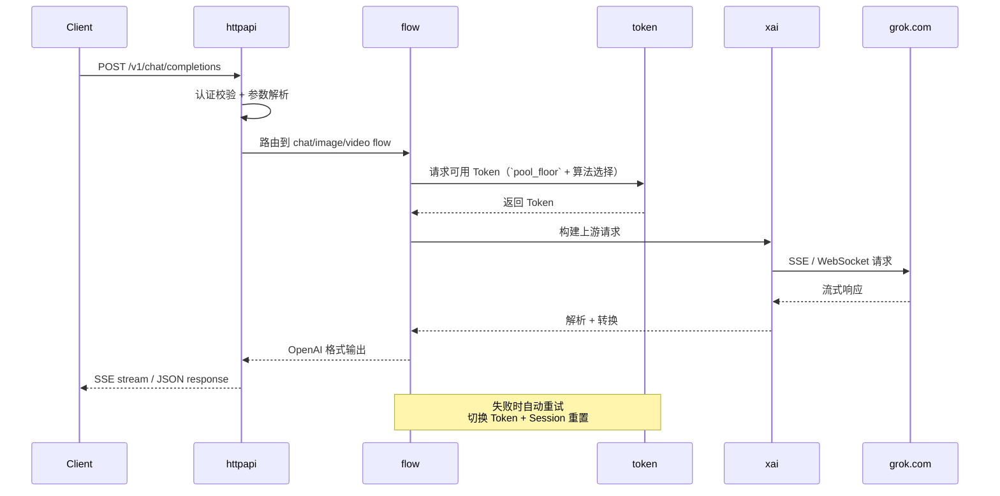

<h1 align="center">GrokForge</h1>

<p align="center">
  <b>Grok 全模型 OpenAI 兼容网关 — 单二进制，开箱即用</b>
</p>

<p align="center">
  <a href="./README.md">English</a> · <b>简体中文</b>
</p>

<p align="center">
  <a href="https://github.com/crmmc/grokforge/releases"></a>
  <a href="https://github.com/crmmc/grokforge/blob/main/LICENSE"></a>
  <a href="https://github.com/crmmc/grokforge"></a>
  <a href="https://github.com/crmmc/grokforge"></a>
</p>

<p align="center">
  
</p>
<p align="center">
  &nbsp;
  
</p>
<p align="center">
  &nbsp;
  
</p>

---

## 这是什么

GrokForge 将 Grok 网页端的全部能力（对话、推理、图片生成/编辑、视频生成）统一包装为标准 OpenAI API 格式（俗称 2api gateway）。你可以直接用任何兼容 OpenAI 的客户端（ChatGPT Next Web、LobeChat、Open WebUI、Cursor、各类 Bot 等）无缝接入 Grok 模型。

> Go 重写 + Next.js 管理面板，编译为单个二进制文件，SQLite 开箱即用，零外部依赖。

---

## 亮点

- **单二进制部署** — 前端通过 `go:embed` 嵌入，拷贝即跑，无需额外运行时
- **现代管理面板** — Next.js + shadcn/ui，Dashboard / Token / API Key / 设置 / 统计 / 缓存一站式管理
- **多池 Token 路由** — ssoBasic / ssoSuper / ssoHeavy 按 `pool_floor` 路由，支持 3 种选择算法和优先级分层
- **静态模型目录** — 模型定义嵌入二进制的 TOML 文件中，支持外部文件覆盖
- **四类独立配额** — Chat / Image / Video / Grok 4.3 分别计量与恢复，互不影响
- **SSE 心跳保活** — 2KB 初始填充 + 15s 心跳，防止反代/CDN 超时断连
- **DeepSearch** — 透传 `deepsearch` 参数，启用 Grok 深度搜索能力
- **配置热重载** — 管理面板修改即时生效，无需重启
- **结构化日志** — slog + 文件轮转，支持 JSON / Text 格式
- **中英双语** — 管理面板支持中英文切换

---

## 功能概览

### 核心能力

- [x] **OpenAI Chat Completions API** — 流式 / 非流式，完整兼容
- [x] **思维链推理** — `<think>` 标签输出推理过程，`reasoning_effort` 可控
- [x] **Tool Calling** — Hermes-style 工具调用，支持 parallel_tool_calls
- [x] **多模态输入** — 图片 URL / base64，自动下载解码缩放
- [x] **图片生成 / 编辑** — WebSocket 通道，支持多张生成，多种尺寸
- [x] **视频生成** — 多种宽高比和分辨率
- [x] **模型列表** — `GET /v1/models` 返回静态目录中已启用的模型
- [x] **SSE 心跳保活** — 2KB 填充 + 15s 心跳，防止反代/CDN 超时断连
- [x] **DeepSearch** — 透传 `deepsearch` 参数，启用 Grok 深度搜索能力

### Token 管理

- [x] **多池路由** — ssoBasic / ssoSuper / ssoHeavy 按 `pool_floor` 选择
- [x] **3 种选择算法** — high_quota_first / random / round_robin
- [x] **Priority 分层** — 高优先级 token 先被选择
- [x] **三类配额** — Chat / Image / Video 独立计量与恢复
- [x] **Grok 4.3 配额** — Grok 4.3 Beta 模型独立配额类别
- [x] **自动刷新** — Session 定时刷新，异常自动重建
- [x] **Token 状态机** — active / cooling / disabled / expired 四态流转

### 模型目录

- [x] **静态 TOML 目录** — 模型定义在 `internal/modelconfig/models.toml`，嵌入二进制
- [x] **外部覆盖** — 在 `config.toml` 中设置 `models_file` 可完全替换默认目录
- [x] **只读管理视图** — Settings 页面展示完整模型目录（不可编辑）
- [x] **注册表驱动路由** — 内存快照提供 O(1) 请求名解析
- [x] **按 mode 覆盖 pool_floor** — 如 expert → basic、heavy → heavy

### 安全与可靠

- [x] **API Key 管理** — CRUD + 模型白名单 + 日限额 + 速率限制
- [x] **指数退避重试** — Jitter + 预算控制 + Session 自动重置
- [x] **Cloudflare 对抗** — FlareSolverr 集成，403 即时刷新 + 防抖
- [x] **安全认证** — 常量时间比较，空 AppKey 拒绝访问

### 管理面板

- [x] **Dashboard** — 统计卡片 + 配额进度 + 调用趋势图
- [x] **Token 管理** — 批量导入 / 启停 / 删除，状态筛选，健康指示
- [x] **API Key 管理** — 创建 / 禁用 / 过期控制 / Key 重新生成
- [x] **系统设置** — General + Models 双标签，General 修改即热重载，Models 为只读目录查看
- [x] **使用统计** — 聚合概览 + 逐条请求日志（含 TTFT）
- [x] **缓存管理** — 图片 / 视频统计，预览 / 下载 / 批量清理
- [x] **功能体验** — Chat / 图片 / 视频生成在线体验，支持多轮对话和 Markdown 渲染

---

## 支持的模型

<details>
<summary><b>Chat 模型</b></summary>

| 模型 | Mode | 池门槛 | 描述 |
|------|------|--------|------|
| `grok-4.20` | default | basic | Grok 4.20 默认模式 |
| `grok-4.20-fast` | fast | basic | Grok 4.20 快速模式 |
| `grok-4.20-think` | think (force_thinking) | basic | 深度推理模式 |
| `grok-4.20-expert` | expert | basic | 专家模式 |
| `grok-4.20-heavy` | heavy | heavy | 仅 Heavy 池可用 |

</details>

<details>
<summary><b>Media 模型</b></summary>

| 模型 | 类型 | 池门槛 | 描述 |
|------|------|--------|------|
| `grok-imagine-image` | image_ws (WebSocket) | super | 完整图片生成 |
| `grok-imagine-image-pro` | image_ws + enable_pro | super | Pro 图片生成 |
| `grok-imagine-image-lite` | image (HTTP) | basic | 轻量图片生成，Basic 池可用 |
| `grok-imagine-image-edit` | image_edit | super | 图片编辑（支持参考图） |
| `grok-imagine-video` | video | super | 视频生成 |

</details>

> 所有模型定义在 `internal/modelconfig/models.toml`（嵌入二进制）。如需自定义，在 `config.toml` 中设置 `models_file` 指向你的 TOML catalog 文件即可完全替换默认目录。

---

## 快速开始

### 30 秒上手

```bash
# 1. 下载 & 启动
./grokforge -config config.toml

# 2. 打开管理面板，添加你的 Grok Token
#    http://localhost:8080

# 3. 测试调用
curl http://localhost:8080/v1/chat/completions \
  -H "Authorization: Bearer your-api-key" \
  -H "Content-Type: application/json" \
  -d '{
    "model": "grok-4.20",
    "messages": [{"role": "user", "content": "Hello!"}],
    "stream": true
  }'
```

### 源码构建

**前置要求**：Go 1.25+、Node.js 18+

```bash
git clone https://github.com/crmmc/grokforge.git
cd grokforge

# 复制配置模板
cp config.defaults.toml config.toml

# 一键构建（前端 + 后端）
make build

# 启动
./bin/grokforge
```

构建产物为单个二进制文件，前端通过 `go:embed` 嵌入，无需额外文件。

---

## 配置说明

GrokForge 使用 TOML 格式配置文件，完整模板见 [`config.defaults.toml`](./config.defaults.toml)。

### 最小配置

```toml
[app]
app_key = "your-admin-password"   # 管理面板密码（必须设置，留空将拒绝所有管理请求）
port = 8080                        # 服务端口

[proxy]
base_proxy_url = ""                # 可选：代理地址
```

启动后在管理面板中添加 Grok Token 即可使用，其余配置均可在线修改。

### 配置优先级

```
管理面板修改（DB） > config.toml > 内置默认值
```

管理面板修改的配置即时生效，无需重启。

### 核心配置项

<details>
<summary><b>应用设置 [app]</b></summary>

| 配置项 | 默认值 | 说明 |
|--------|--------|------|
| `app_key` | `""` | 管理面板密码（留空拒绝所有管理请求） |
| `port` | `8080` | 服务端口 |
| `host` | `"0.0.0.0"` | 监听地址 |
| `db_driver` | `"sqlite"` | 数据库驱动：`sqlite` / `postgres` |
| `db_path` | `"data/grokforge.db"` | SQLite 文件路径 |
| `db_dsn` | `""` | PostgreSQL 连接串 |
| `log_level` | `"info"` | 日志级别：debug/info/warn/error |
| `log_json` | `false` | JSON 格式日志 |
| `request_timeout` | `60` | 非大模型路由默认超时（秒） |
| `temporary` | `true` | 临时会话模式 |
| `thinking` | `true` | 默认开启思维链 |
| `stream` | `true` | 默认流式响应 |
| `filter_tags` | `[...]` | 过滤的特殊标签列表 |

</details>

<details>
<summary><b>代理设置 [proxy]</b></summary>

| 配置项 | 默认值 | 说明 |
|--------|--------|------|
| `base_proxy_url` | `""` | 上游代理（HTTP/HTTPS/SOCKS5） |
| `asset_proxy_url` | `""` | 资产代理（图片下载等） |
| `cf_clearance` | `""` | Cloudflare clearance cookie |
| `browser` | `"chrome_146"` | TLS 指纹浏览器型号 |
| `enabled` | `false` | 启用 CF 自动刷新 |
| `flaresolverr_url` | `""` | FlareSolverr 服务地址 |
| `refresh_interval` | `3600` | CF 刷新间隔（秒） |

</details>

<details>
<summary><b>重试策略 [retry]</b></summary>

| 配置项 | 默认值 | 说明 |
|--------|--------|------|
| `max_tokens` | `5` | 最大重试 Token 数 |
| `per_token_retries` | `2` | 单 Token 重试上限 |
| `reset_session_status_codes` | `[403]` | 触发 Session 重置的状态码 |
| `cooling_status_codes` | `[429]` | 触发 Token 冷却的状态码 |
| `retry_backoff_base` | `0.5` | 退避基础延迟（秒） |
| `retry_backoff_factor` | `2.0` | 退避倍率 |
| `retry_backoff_max` | `20.0` | 单次最大延迟（秒） |
| `retry_budget` | `60.0` | 总重试预算（秒） |

</details>

<details>
<summary><b>Token 管理 [token]</b></summary>

| 配置项 | 默认值 | 说明 |
|--------|--------|------|
| `fail_threshold` | `5` | 连续失败阈值（达到后标记 expired） |
| `usage_flush_interval_sec` | `30` | 使用量写入数据库的间隔 |
| `cool_check_interval_sec` | `30` | 检查冷却恢复的间隔 |
| `basic_cool_duration_min` | `240` | Basic 池冷却时长（分钟） |
| `super_cool_duration_min` | `120` | Super 池冷却时长（分钟） |
| `heavy_cool_duration_min` | `60` | Heavy 池冷却时长（分钟） |
| `default_chat_quota` | `50` | 每个 Token 的默认 Chat 配额 |
| `default_image_quota` | `20` | 每个 Token 的默认 Image 配额 |
| `default_video_quota` | `10` | 每个 Token 的默认 Video 配额 |
| `quota_recovery_mode` | `"auto"` | 配额恢复模式：`auto` 或 `upstream` |
| `selection_algorithm` | `"high_quota_first"` | 选择算法：high_quota_first / random / round_robin |

</details>

---

## 架构

```
┌─────────────────────────────────────────────────┐
│                   Client                        │
│   (ChatGPT Next Web / LobeChat / curl / ...)    │
└─────────────────────┬───────────────────────────┘
                      │ OpenAI API
                      ▼
┌─────────────────────────────────────────────────┐
│                   GrokForge                     │
│                                                 │
│  ┌───────────┐  ┌───────────┐  ┌────────────┐  │
│  │  httpapi   │  │   Admin   │  │  Static    │  │
│  │ (OpenAI)  │  │   API     │  │  Frontend  │  │
│  └─────┬─────┘  └─────┬─────┘  └────────────┘  │
│        │              │                         │
│        ▼              ▼                         │
│  ┌─────────────────────────────────────────┐    │
│  │              flow (编排层)               │    │
│  │  chat / image / video / model registry  │    │
│  └──────┬──────────┬──────────┬────────────┘    │
│         │          │          │                  │
│         ▼          ▼          ▼                  │
│  ┌──────────┐ ┌─────────┐ ┌──────────┐         │
│  │  token   │ │   xai   │ │  store   │         │
│  │ (池管理) │ │(上游通信)│ │ (持久化) │         │
│  └──────────┘ └─────────┘ └──────────┘         │
│                    │                            │
└────────────────────┼────────────────────────────┘
                     │
                     ▼
              ┌─────────────┐
              │   grok.com  │
              │ (SSE / WS)  │
              └─────────────┘
```

三段式分层：**httpapi**（协议转换）→ **flow**（业务编排）→ **xai / token / store**（基础设施）

依赖方向单向，无循环引用。

---

## API 使用示例

### Chat Completion（流式）

```bash
curl http://localhost:8080/v1/chat/completions \
  -H "Authorization: Bearer your-api-key" \
  -H "Content-Type: application/json" \
  -d '{
    "model": "grok-4.20",
    "messages": [{"role": "user", "content": "用一句话解释量子计算"}],
    "stream": true
  }'
```

### 思维链模型

```bash
curl http://localhost:8080/v1/chat/completions \
  -H "Authorization: Bearer your-api-key" \
  -H "Content-Type: application/json" \
  -d '{
    "model": "grok-4.20-expert",
    "messages": [{"role": "user", "content": "证明 √2 是无理数"}],
    "reasoning_effort": "high"
  }'
```

### Tool Calling

```bash
curl http://localhost:8080/v1/chat/completions \
  -H "Authorization: Bearer your-api-key" \
  -H "Content-Type: application/json" \
  -d '{
    "model": "grok-4.20",
    "messages": [{"role": "user", "content": "北京今天天气怎么样？"}],
    "tools": [{
      "type": "function",
      "function": {
        "name": "get_weather",
        "description": "获取指定城市的天气",
        "parameters": {
          "type": "object",
          "properties": {
            "city": {"type": "string", "description": "城市名"}
          },
          "required": ["city"]
        }
      }
    }]
  }'
```

### 多模态（图片输入）

```bash
curl http://localhost:8080/v1/chat/completions \
  -H "Authorization: Bearer your-api-key" \
  -H "Content-Type: application/json" \
  -d '{
    "model": "grok-4.20",
    "messages": [{
      "role": "user",
      "content": [
        {"type": "text", "text": "描述这张图片"},
        {"type": "image_url", "image_url": {"url": "https://example.com/image.jpg"}}
      ]
    }]
  }'
```

### 图片生成

```bash
curl http://localhost:8080/v1/chat/completions \
  -H "Authorization: Bearer your-api-key" \
  -H "Content-Type: application/json" \
  -d '{
    "model": "grok-imagine-image",
    "messages": [{"role": "user", "content": "一只穿着太空服的柴犬在月球上散步"}]
  }'
```

### 视频生成

```bash
curl http://localhost:8080/v1/chat/completions \
  -H "Authorization: Bearer your-api-key" \
  -H "Content-Type: application/json" \
  -d '{
    "model": "grok-imagine-video",
    "messages": [{"role": "user", "content": "一只猫咪在钢琴上跳舞"}]
  }'
```

---

## 客户端集成

GrokForge 兼容所有支持 OpenAI API 的客户端，只需将 API 地址指向 GrokForge：

| 客户端 | 配置方式 |
|--------|----------|
| **ChatGPT Next Web** | 设置 → API 地址 = `http://your-host:8080` |
| **LobeChat** | 设置 → OpenAI → API 地址 = `http://your-host:8080/v1` |
| **Open WebUI** | 管理 → 连接 → OpenAI API = `http://your-host:8080/v1` |
| **Cursor** | 设置 → Models → OpenAI Base URL = `http://your-host:8080/v1` |
| **任意 OpenAI SDK** | `base_url="http://your-host:8080/v1"` |

---

## 请求流程



---

## 管理面板

> 管理面板地址：`http://your-host:8080`

管理面板功能包括：

- **Dashboard** — 一目了然的系统状态：Token 数量、API Key 数、调用量、配额进度、趋势图表
- **Token 管理** — 批量导入 / 启停 / 删除、状态筛选、配额修改、优先级设置、手动刷新
- **API Key** — 创建与管理 API 密钥、模型白名单、日限额、速率限制
- **模型目录** — 静态模型目录只读查看，含 pool_floor 和 upstream 详情
- **设置** — General 配置在线编辑（热重载）+ 只读模型目录查看
- **使用统计** — 聚合概览 + 逐条请求日志（包含 TTFT、Token 消耗等指标）
- **缓存** — 图片/视频缓存浏览、预览、下载、清理
- **功能体验** — Chat / 图片 / 视频生成在线体验，支持多轮对话和 Markdown 渲染

---

## 常见问题

<details>
<summary><b>如何获取 Grok Token？</b></summary>

1. 登录 [grok.com](https://grok.com)
2. 打开浏览器开发者工具（F12）
3. 在 Application → Cookies 中找到 `sso` 或 `sso-rw` 开头的 cookie 值
4. 在管理面板中导入该值

</details>

<details>
<summary><b>Basic、Super 和 Heavy 池有什么区别？</b></summary>

- **Basic 池 (`ssoBasic`)**：最低能力门槛，只能满足 `pool_floor = basic` 的模型或 mode。
- **Super 池 (`ssoSuper`)**：更高能力门槛，可满足 `super` 和 `basic` 请求。
- **Heavy 池 (`ssoHeavy`)**：最高能力门槛，专门承接 `heavy` 请求，也可以服务更低门槛的请求。
- 模型路由由静态模型目录（`internal/modelconfig/models.toml`）定义，不再通过手写池内模型列表控制。
- `pool_floor` 是硬门槛。如果在所有等级 >= 该门槛的池中都没有可用 Token，请求会直接失败，不会静默降级。

</details>

<details>
<summary><b>遇到 403 错误怎么办？</b></summary>

通常是 Cloudflare 防护触发。解决方案：

1. **配置代理**：设置 `base_proxy_url` 使用干净 IP
2. **FlareSolverr**：配置 `flaresolverr_url`，GrokForge 会自动刷新 CF cookie
3. **手动更新**：在管理面板中更新 `cf_clearance` cookie

</details>

<details>
<summary><b>Token 配额耗尽后多久恢复？</b></summary>

取决于配额恢复模式：

- **auto 模式**（默认）：冷却窗口到期后恢复为配置中的默认配额
- **upstream 模式**：冷却窗口到期后从 Grok 的 rate-limits API 同步真实配额

Token 配额耗尽后会进入 `cooling` 状态，恢复后自动切回 `active`。

</details>

<details>
<summary><b>如何用于多人共享？</b></summary>

1. 在管理面板创建 API Key，为每人分配独立 Key
2. 设置 **Model Whitelist** 限制可用模型
3. 设置 **Daily Limit** 控制每人每日调用量
4. 设置 **Rate Limit** 防止突发请求

</details>

<details>
<summary><b>支持哪些数据库？</b></summary>

- **SQLite**（默认）：零配置，数据存储在 `data/grokforge.db`
- **PostgreSQL**：生产环境推荐，配置 `db_driver = "postgres"` 和 `db_dsn`

两种数据库功能完全一致，启动时按当前 schema 初始化。
本地开发如果 schema 变化，直接删除 `data/grokforge.db` 后重建，不保留旧库迁移逻辑。

</details>

---

## 技术栈

| 层 | 技术 |
|----|------|
| 后端 | Go 1.25 · chi · GORM · slog |
| 前端 | Next.js · shadcn/ui · Tailwind CSS · Recharts |
| 存储 | SQLite (default) · PostgreSQL (optional) |
| 构建 | Make · go:embed (前端嵌入二进制) |

---

## 项目结构

```
grokforge/
├── cmd/grokforge/       # 入口
├── internal/
│   ├── httpapi/         # HTTP 层（OpenAI 兼容 + Admin API）
│   │   └── openai/      # OpenAI 协议实现
│   ├── flow/            # 业务编排（chat / image / video）
│   ├── token/           # Token 池管理（路由 / 选择 / 配额 / 刷新）
│   ├── xai/             # 上游通信（SSE / WebSocket）
│   ├── store/           # 持久化（GORM + 当前 schema / 约束）
│   ├── modelconfig/    # 静态模型目录（TOML 嵌入 + 加载器）
│   ├── config/          # 配置管理（TOML + DB 覆盖 + 热重载）
│   ├── cfrefresh/       # Cloudflare 防护（FlareSolverr 集成）
│   ├── cache/           # 缓存管理（图片 / 视频本地缓存）
│   └── logging/         # 日志管理（slog + 文件轮转）
├── web/                 # Next.js 前端
│   └── src/app/         # 页面路由
├── config.defaults.toml # 配置模板
└── Makefile             # 构建脚本
```

---

## 致谢

- [grok2api](https://github.com/chenyme/grok2api) — 原版 Python 项目，验证了可行性
- [chi](https://github.com/go-chi/chi) — 轻量 HTTP 路由
- [GORM](https://gorm.io) — Go ORM
- [shadcn/ui](https://ui.shadcn.com) — UI 组件库

---

## 更新日志

查看 [CHANGELOG.md](./CHANGELOG.md) 了解版本历史和更新详情。

---

## Star History

<a href="https://github.com/crmmc/grokforge/stargazers">
  <picture>
    <source media="(prefers-color-scheme: dark)" srcset="https://api.star-history.com/svg?repos=crmmc/grokforge&type=Date&theme=dark" />
    <source media="(prefers-color-scheme: light)" srcset="https://api.star-history.com/svg?repos=crmmc/grokforge&type=Date" />
    
  </picture>
</a>

---

## License

[MIT](./LICENSE)

---

> **免责声明**：本项目仅供学习和研究使用。使用者需遵守相关服务的使用条款，因使用本项目产生的任何后果由使用者自行承担。
